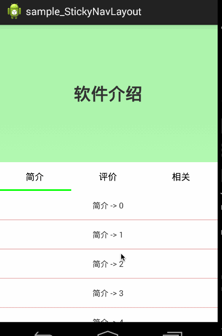

# Android-StickyNavLayout
An android library for navigator that stick on the top 


# 效果图




# 用法
直接作为跟布局，内部一次放置，顶部内容区域，导航，ViewPager。
注意id，需要使用预定的id资源。

```xml
<com.zhy.view.StickyNavLayout xmlns:tools="http://schemas.android.com/tools"
    xmlns:android="http://schemas.android.com/apk/res/android"
    android:layout_width="match_parent"
    android:layout_height="match_parent"
    android:orientation="vertical" >

    <RelativeLayout
        android:id="@id/id_stickynavlayout_topview"
        android:layout_width="match_parent"
        android:layout_height="300dp"
        android:background="#4400ff00" >

        <TextView
            android:layout_width="match_parent"
            android:layout_height="match_parent"
            android:gravity="center"
            android:text="软件介绍"
            android:textSize="30sp"
            android:textStyle="bold" />
    </RelativeLayout>

    <com.zhy.view.SimpleViewPagerIndicator
        android:id="@id/id_stickynavlayout_indicator"
        android:layout_width="match_parent"
        android:layout_height="50dp"
        android:background="#ffffffff" >
    </com.zhy.view.SimpleViewPagerIndicator>

    <android.support.v4.view.ViewPager
        android:id="@id/id_stickynavlayout_viewpager"
        android:layout_width="match_parent"
        android:layout_height="match_parent"
        android:background="#44ff0000" >
    </android.support.v4.view.ViewPager>

</com.zhy.view.StickyNavLayout>

```

#关于我

[我的博客地址][3]

[3]: http://blog.csdn.net/lmj623565791
